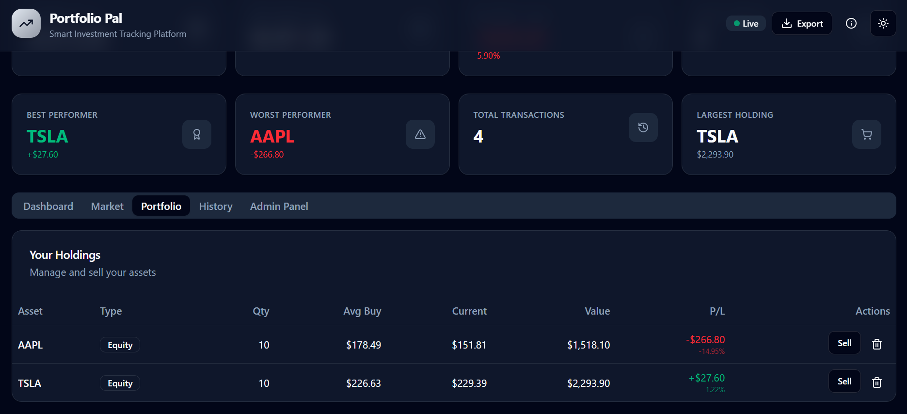
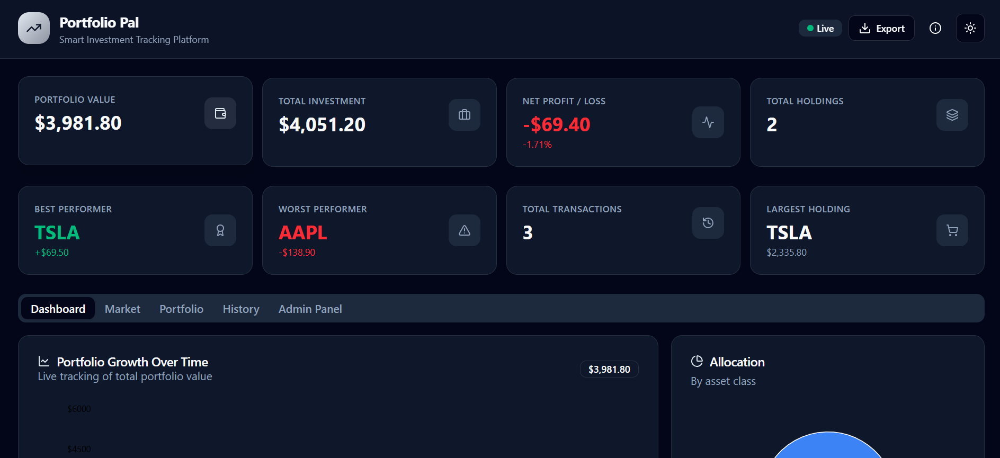
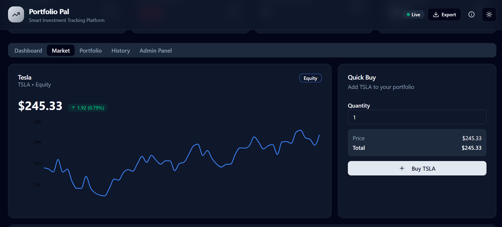
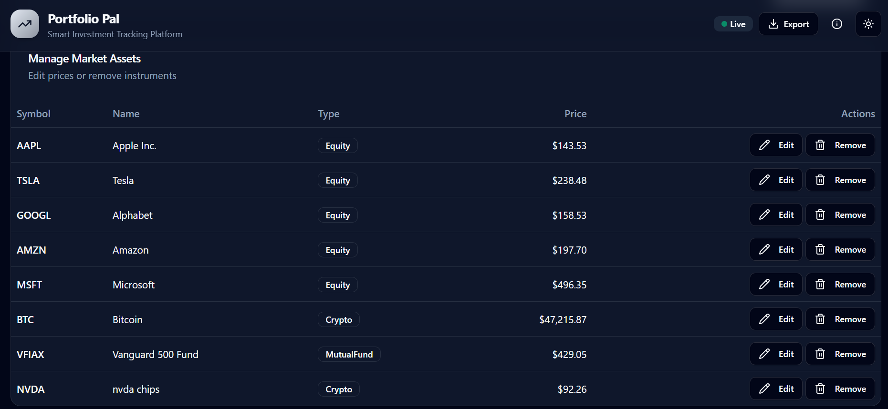

# 📈 Portfolio Pal

A modern portfolio management web application that allows users to track investments, simulate market activity, analyze portfolio performance, and manage financial assets through an interactive dashboard.

🔗 **Live Demo:** https://portfolio-pal-investment-tracker.lovable.app

---

## 🚀 Features

### 👤 Portfolio Management
- Buy and sell assets
- Track portfolio value in real time
- View total investment and profit/loss
- Monitor total holdings and transactions

### 📊 Analytics Dashboard
- Portfolio Value Overview
- Net Profit/Loss Tracking
- Best Performer Analysis
- Worst Performer Analysis
- Investment Summary Cards

### 📈 Market Simulation
- Simulated live stock market
- Dynamic asset pricing
- Real-time portfolio updates
- Performance tracking

### 🛠 Asset Management
- Add new stocks to the market
- Remove stocks from the market
- Manage available investment options
- Search and filter assets

### 📜 Transaction Tracking
- Complete transaction history
- Buy/Sell records
- Activity timeline
- Investment audit trail

### 🎨 User Experience
- Responsive design
- Modern dashboard UI
- Light/Dark mode support
- Interactive data visualization
- Professional financial application layout

### 📂 Export & Reporting
- Portfolio summary reports
- Investment insights
- Downloadable portfolio data

---

## 🧰 Technologies Used

- React
- TypeScript
- Tailwind CSS
- Vite
- Lovable
- Modern Component-Based Architecture

---

## 🏗 Project Structure

```text
src/
├── components/
├── routes/
├── hooks/
├── lib/
├── styles.css
├── router.tsx
└── server.ts
```

---

## 📸 Application Preview

### Portfolio Dashboard


### Analytics Dashboard


### Market Tracking


### Admin Panel


## 🎯 Key Highlights

- Interactive investment tracking platform
- Real-time portfolio analytics
- Market simulation environment
- Asset management system
- Professional dashboard design
- Fully responsive user interface
- Resume-ready portfolio project

---

## 🔮 Future Improvements

- Portfolio allocation charts
- Watchlist functionality
- Advanced filtering and sorting
- CSV/PDF exports
- Authentication system
- Real market API integration
- AI-powered investment insights

---

## 👩‍💻 Author

**Joshitha Gajjala**

B.Tech CSE (IoT) Student  
Shiv Nadar University

- GitHub: https://github.com/joshithagajjala
- Live Demo: https://portfolio-pal-investment-tracker.lovable.app

---

⭐ If you found this project interesting, consider giving it a star:).
